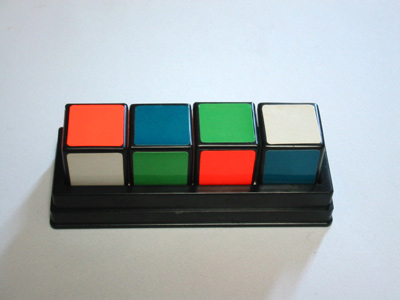

# cube4

キューブ4とは，一つの面がそれぞれ4色どれかに塗られた6面キューブを4つ並べて，4面とも色が異なるようにするゲーム．
このリポジトリは，キューブ4を解くためのプログラム．

# cube4について

4色で塗られた6面キューブを，
上・下・前・後から見て4つのキューブの面が異なるように並べることができたら成功．

# 解法

現在，総当たりによる探索が実装されている．
また，回転したものは別の組み合わせとして認識している．

# 寄与
[キューブ4 画像](http://frog-port.jugem.jp/?eid=180)
